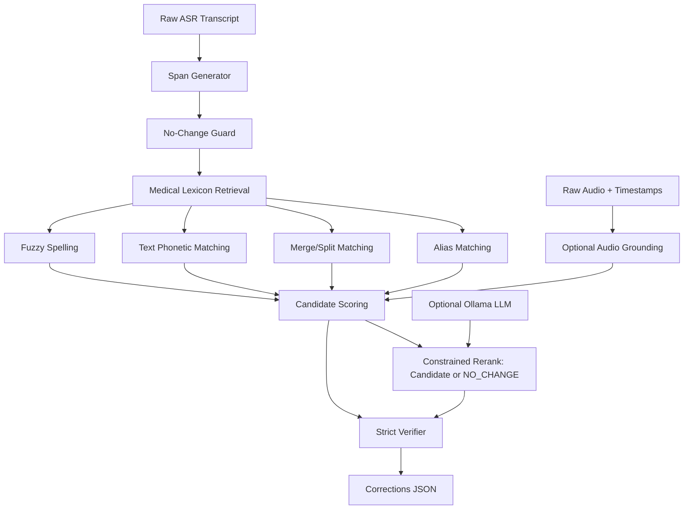

# Medical Transcript Correction Pipeline

This is the correction system added on top of the earlier sound embedding work.

## Goal

Clean raw ASR medical transcripts by finding suspicious medical spans and replacing them with validated medical terms.

The production rule is conservative:

- auto-fix only when evidence is strong
- keep already-correct medical terms unchanged
- use the LLM only as a constrained reranker, not as a free generator
- use raw audio as extra evidence when timestamps are available

## Architecture



## Files

- `medical_corrector.py`: main correction engine
- `audio_grounding.py`: optional audio segment vs candidate scoring
- `data/medical_lexicon.jsonl`: seed medical lexicon
- `eval_corrector.py`: scorer for the eval set
- `eval/medical_transcript_eval.jsonl`: current benchmark

## Run One Transcript

```bash
source .venv/bin/activate
python medical_corrector.py "I will prescribe amoktisillin and dextrose and thorepine."
```

## Run Evaluation

```bash
source .venv/bin/activate
python eval_corrector.py --show-errors
```

Current result on the starter benchmark:

- detection recall: `100%`
- correction recall: `100%`
- negative clean rate: `100%`

## Optional LLM Reranking

The deterministic retriever is the core. The LLM is optional:

```bash
python medical_corrector.py --use-llm "raw transcript here"
```

The LLM is constrained to choose from retrieved candidates or `NO_CHANGE`.
It is not allowed to invent corrections.

## Optional Audio Grounding

Use this only when you have timestamps for a suspicious span:

```python
from audio_grounding import AudioGrounder

grounder = AudioGrounder()
scores = grounder.rank_candidates_for_segment(
    audio_path="recording.wav",
    start_seconds=31.2,
    end_seconds=33.0,
    candidates=["dextromethorphan", "dextrose", "norepinephrine"],
)

for item in scores:
    print(item.candidate, item.score)
```

This reuses the existing `pipeline.py` sound embedding stack.

## Important

The current eval set is small and partially synthetic. Hitting 100% here means the architecture works on this benchmark, not that real-world accuracy is guaranteed. The next step is to expand the eval set with real ASR outputs and real audio timestamps.
