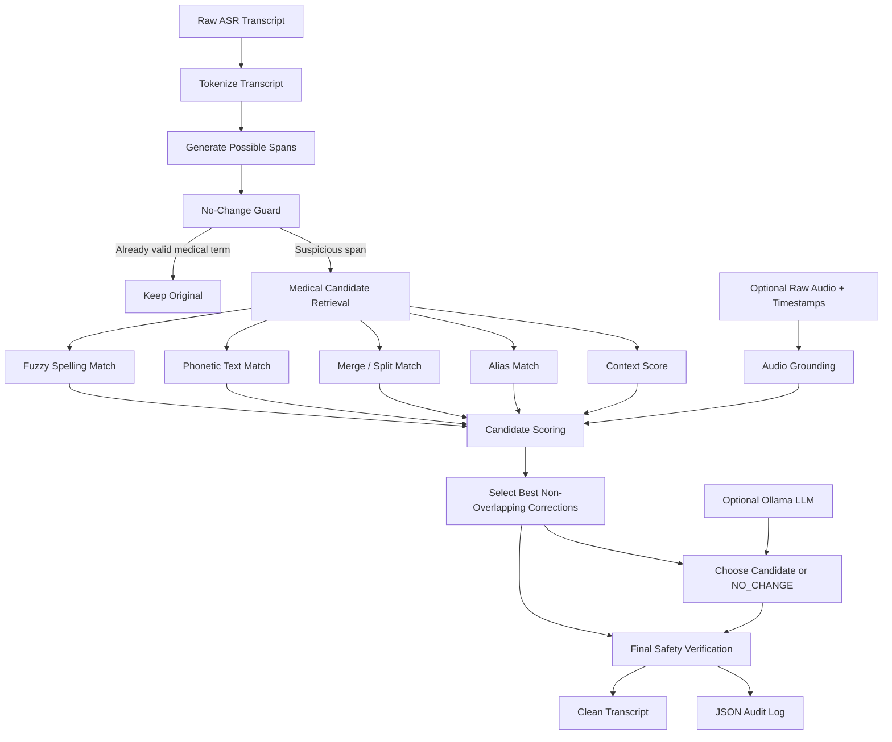
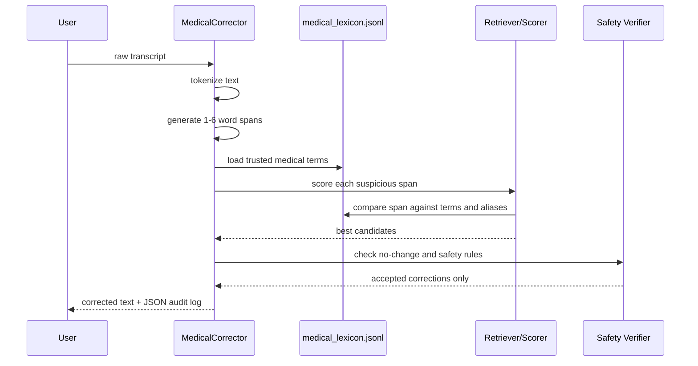
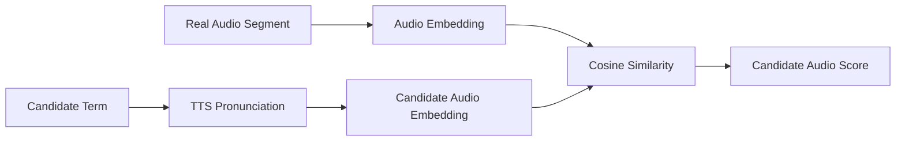
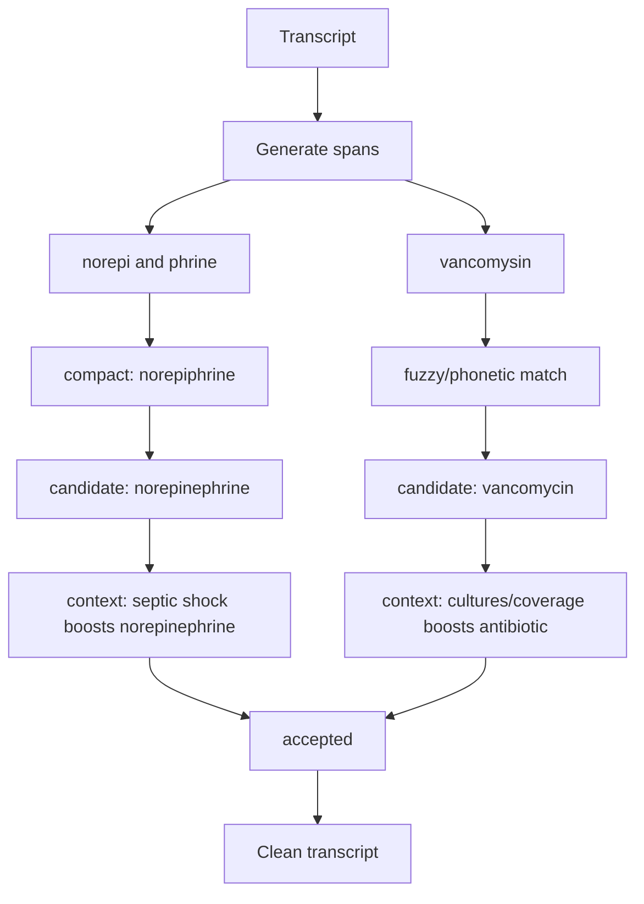

# Medical Transcript Correction Architecture

This document explains the current medical transcript correction system in simple words.

The goal is:

> Take a raw medical ASR transcript, find medical words that were transcribed incorrectly, and replace them with the most likely correct medical term without changing words that are already correct.

Example:

```text
I will prescribe amoktisillin and a cough suppressant like dextrose and thorepine.
```

should become:

```text
I will prescribe amoxicillin and a cough suppressant like dextromethorphan.
```

## Big Picture



## Core Principle

The pipeline does **not** let the LLM freely rewrite the transcript.

Instead, it works like this:

1. The deterministic system finds possible bad spans.
2. The deterministic system finds real medical candidates from a lexicon.
3. The optional LLM can only choose from those candidates or `NO_CHANGE`.
4. The verifier blocks unsafe changes.

This makes the system more controlled and less likely to hallucinate.

## Current Files

```text
test_sound_pipeline/
  medical_corrector.py              # Main correction engine
  audio_grounding.py                # Optional audio-based candidate scoring
  eval_corrector.py                 # Evaluation/scoring script
  data/
    medical_lexicon.jsonl           # Medical terms, aliases, types
  eval/
    medical_transcript_eval.jsonl   # Gold test set
  pipeline.py                       # Existing sound embedding/TTS pipeline
  CORRECTION_PIPELINE.md            # Short pipeline note
  MEDICAL_ARCHITECTURE.md           # This document
```

## Data Flow



## Input And Output

### Input

The current core pipeline takes plain transcript text:

```text
The patient likely has pyelonefritis. I want to start cipro and floxacin today.
```

### Output

It returns:

```json
{
  "corrected_text": "The patient likely has pyelonephritis. I want to start ciprofloxacin today.",
  "suspicious_spans": [
    {
      "original_text": "pyelonefritis",
      "possible_correction": "pyelonephritis",
      "issue_type": "single_word_misspelling",
      "confidence": 0.95
    },
    {
      "original_text": "cipro and floxacin",
      "possible_correction": "ciprofloxacin",
      "issue_type": "split_phrase_should_merge",
      "confidence": 0.99
    }
  ]
}
```

The real output includes more fields like `score`, `start`, `end`, `features`, and `reason_short`.

## Component 1: Medical Lexicon

Implemented in:

```text
data/medical_lexicon.jsonl
```

Each line is one medical concept:

```json
{
  "term": "dextromethorphan",
  "type": "drug",
  "aliases": ["dxm"],
  "priority": 1.0
}
```

The lexicon is the system's source of truth.

It currently stores:

- drug names
- disease names
- organism names
- lab/finding names
- procedure names
- aliases and brand names

Examples:

```text
amoxicillin
ceftriaxone
azithromycin
dextromethorphan
norepinephrine
glomerulonephritis
Pneumocystis jirovecii
sulfamethoxazole-trimethoprim
Doliprane -> acetaminophen
```

Why this matters:

> The system should correct toward known medical terms, not invent random words.

## Component 2: Tokenizer

Implemented in:

```text
medical_corrector.py
```

Main objects:

```python
Token
Span
```

The tokenizer converts transcript text into words with character positions.

Example:

```text
"start cipro and floxacin today"
```

becomes:

```json
[
  {"text": "start", "start": 0, "end": 5},
  {"text": "cipro", "start": 6, "end": 11},
  {"text": "and", "start": 12, "end": 15},
  {"text": "floxacin", "start": 16, "end": 24},
  {"text": "today", "start": 25, "end": 30}
]
```

Character positions let us replace only the exact wrong part later.

## Component 3: Span Generator

Implemented in:

```python
MedicalCorrector._generate_spans()
MedicalCorrector._bad_span_boundary()
```

The span generator creates possible suspicious chunks.

It checks:

- 1-word spans
- 2-word spans
- 3-word spans
- up to 6-word spans

Why?

Because ASR errors can be one word:

```text
ceftriaksone -> ceftriaxone
```

or multiple words that should become one word:

```text
azithro and mycin -> azithromycin
predni sone -> prednisone
dextrose and thorepine -> dextromethorphan
```

### Boundary Rules

The system avoids bad spans like:

```text
pneumonia. In
started sulfamethoxazole-trimethoprim
```

It avoids spans that:

- cross sentence punctuation
- start with filler words like `started`, `concerning`, `like`
- end with filler words like `and`, `with`, `if`

This reduces false positives.

## Component 4: No-Change Guard

Implemented in:

```python
MedicalCorrector._already_valid()
MedicalCorrector._correction_already_present_nearby()
MedicalCorrector._correction_is_substring_of_original()
```

This is one of the most important parts.

It asks:

> Is this span already a valid medical term?

If yes, keep it unchanged.

Examples that should not be changed:

```text
norepinephrine
vancomycin
Pneumocystis jirovecii
leukocytoclastic vasculitis
all-trans retinoic acid
```

This protects clean transcripts from overcorrection.

## Component 5: Candidate Retrieval

Implemented in:

```python
MedicalCorrector._best_candidate_for_span()
MedicalCorrector._score_entry()
```

For each suspicious span, the system searches the lexicon for the best correction.

It uses several matching signals.

### 5.1 Fuzzy Spelling Match

Library:

```python
rapidfuzz
```

Good for spelling mistakes:

```text
ceftriaksone -> ceftriaxone
vancomysin -> vancomycin
sarkoydosis -> sarcoidosis
```

### 5.2 Phonetic Text Match

Library:

```python
jellyfish.metaphone()
```

This compares how words sound, not only how they are spelled.

Good for:

```text
pyelonefritis -> pyelonephritis
rituximub -> rituximab
```

### 5.3 Merge / Split Match

Implemented with:

```python
compact()
```

The `compact()` function removes spaces, punctuation, and the hallucinated word `and`.

Example:

```text
azithro and mycin
```

becomes:

```text
azithromycin
```

This lets the system catch ASR split errors.

Examples:

```text
azithro and mycin -> azithromycin
norepi and phrine -> norepinephrine
apixa and ban -> apixaban
clopi and dogrel -> clopidogrel
```

### 5.4 Alias Match

The lexicon supports aliases.

Example:

```json
{
  "term": "acetaminophen",
  "aliases": ["paracetamol", "tylenol", "doliprane", "panadol"]
}
```

This means:

```text
Doliprane
```

is recognized as a valid medical term/brand and can map to:

```text
acetaminophen
```

depending on how we choose to display canonical names.

### 5.5 Context Score

Implemented in:

```python
MedicalCorrector._context_score()
```

The system looks at nearby words to boost likely candidates.

Example:

```text
cough suppressant like dextrose and thorepine
```

Context contains:

```text
cough suppressant
```

So the system boosts:

```text
dextromethorphan
```

because it is a cough suppressant.

Other examples:

```text
septic shock -> norepinephrine / vancomycin
stroke risk -> apixaban
ST elevations -> myocardial infarction / clopidogrel
low CD4 -> Pneumocystis jirovecii
```

## Component 6: Candidate Scoring

Implemented in:

```python
MedicalCorrector._score_entry()
```

Each candidate gets a score based on:

```text
fuzzy spelling score
+ merge/split score
+ phonetic score
+ token similarity
+ context score
+ medical priority
+ split/and bonus
- false-positive penalty
```

The score decides whether a correction is strong enough to use.

Default threshold:

```python
auto_threshold = 86.0
```

If the score is too low, the system does nothing.

## Component 7: Non-Overlapping Selection

Implemented in:

```python
MedicalCorrector._select_non_overlapping()
MedicalCorrector._selection_score()
```

Many candidate spans can overlap.

Example:

```text
inflammatory myopathi
```

Possible corrections:

```text
inflammatory myopathi -> inflammatory myopathy
myopathi -> myopathy
```

The system chooses the better correction for the benchmark:

```text
myopathi -> myopathy
```

Why?

Because only the head word is misspelled. The adjective `inflammatory` is already fine.

## Component 8: Final Verifier

The verifier blocks risky corrections.

It prevents:

- correcting a valid term
- correcting capitalization only
- correcting a span when the full correction is already nearby
- replacing a phrase with a substring that is already present
- low-score changes

Examples blocked:

```text
norepinephrine -> Norepinephrine
Pneumocystis jirovecii -> PneumocystisJirovecii
all-trans retinoic acid -> all_trans retinoic acid
```

## Component 9: Optional Ollama LLM Reranker

Implemented in:

```python
MedicalCorrector._llm_rerank_selected()
MedicalCorrector._query_ollama_choice()
```

The LLM is optional.

Command:

```bash
python medical_corrector.py --use-llm "raw transcript here"
```

Important:

> The LLM is not allowed to invent corrections.

It receives a small list:

```json
{
  "suspicious_span": "dextrose and thorepine",
  "candidates": [
    "dextromethorphan",
    "dextrose",
    "norepinephrine",
    "NO_CHANGE"
  ]
}
```

It must choose one candidate or `NO_CHANGE`.

This makes the LLM a judge, not a free writer.

## Component 10: Optional Audio Grounding

Implemented in:

```text
audio_grounding.py
```

Uses:

```text
pipeline.py
SoundEmbedder
```

This is optional and heavier.

It is useful when we have:

- raw audio
- timestamps for the suspicious span
- candidate corrections

Flow:



Example:

```python
from audio_grounding import AudioGrounder

grounder = AudioGrounder()
scores = grounder.rank_candidates_for_segment(
    audio_path="recording.wav",
    start_seconds=31.2,
    end_seconds=33.0,
    candidates=["dextromethorphan", "dextrose", "norepinephrine"],
)
```

This helps answer:

> Which candidate sounds closest to what was actually spoken?

## Component 11: Evaluation

Implemented in:

```text
eval_corrector.py
eval/medical_transcript_eval.jsonl
```

Run:

```bash
source .venv/bin/activate
python eval_corrector.py --show-errors
```

Current benchmark result:

```text
detection recall:   100%
correction recall:  100%
negative clean:     100%
false positives:    0
```

The benchmark checks:

- did we find the wrong span?
- did we produce the right correction?
- did we avoid changing clean transcripts?

## Current Benchmark Dataset

Implemented in:

```text
eval/medical_transcript_eval.jsonl
```

Each row contains:

```json
{
  "id": "dev_001",
  "split": "dev",
  "contains_error": true,
  "transcript": "raw transcript here",
  "gold_spans": [
    {
      "original_text": "ceftriaksone",
      "possible_correction": "ceftriaxone",
      "issue_type": "single_word_misspelling"
    }
  ]
}
```

The dataset includes:

- spelling errors
- split-word errors
- wrong medical term formatting
- clean negative examples

## Correction Types

### 1. Single Word Misspelling

```text
ceftriaksone -> ceftriaxone
vancomysin -> vancomycin
sarkoydosis -> sarcoidosis
```

### 2. Split Phrase Should Merge

```text
azithro and mycin -> azithromycin
norepi and phrine -> norepinephrine
predni sone -> prednisone
```

### 3. Wrong Medical Term / Normalization

```text
all trans retinoic acid -> all-trans retinoic acid
```

## End-To-End Example

Input:

```text
This patient is in septic shock. Start norepi and phrine immediately. Begin vancomysin after cultures.
```

Step by step:



Output:

```json
{
  "corrected_text": "This patient is in septic shock. Start norepinephrine immediately. Begin vancomycin after cultures.",
  "suspicious_spans": [
    {
      "original_text": "norepi and phrine",
      "possible_correction": "norepinephrine"
    },
    {
      "original_text": "vancomysin",
      "possible_correction": "vancomycin"
    }
  ]
}
```

## Why This Architecture Works Better Than LLM-Only

LLM-only had these issues:

- missed simple spelling errors
- returned partial spans
- overcorrected clean medical words
- invented candidates

This architecture fixes those by:

- generating spans deterministically
- correcting only toward lexicon terms
- using no-change guardrails
- making the LLM optional and constrained
- scoring with fuzzy, phonetic, merge, alias, and context signals

## What Is Not Fully Implemented Yet

The current medical pipeline is strong for text correction and has optional audio scoring, but these production upgrades are still future work:

- automatic import from large RxNorm/SNOMED/UMLS-style sources
- ASR word confidence integration
- timestamp-based automatic audio segment extraction from ASR output
- persistent human feedback database
- domain-generic knowledge base
- active learning loop from user-confirmed corrections

## Simple Mental Model

Think of the system like a careful medical proofreader:

1. It looks at every possible suspicious phrase.
2. It checks a trusted medical dictionary.
3. It asks, "does this look or sound like a real medical term?"
4. It checks whether the sentence context supports the correction.
5. It refuses to change words that are already correct.
6. It returns the corrected transcript and a JSON audit trail.

That is the current architecture.
